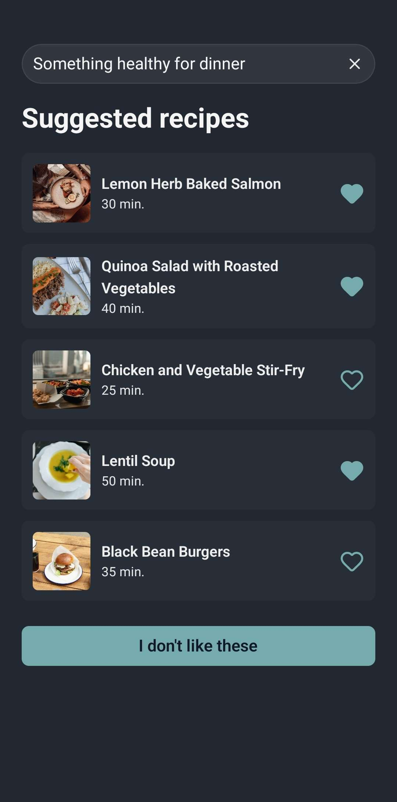
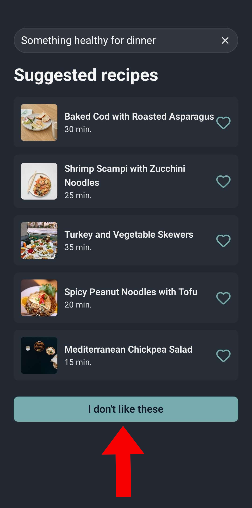
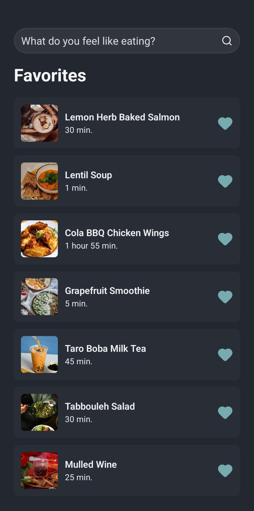
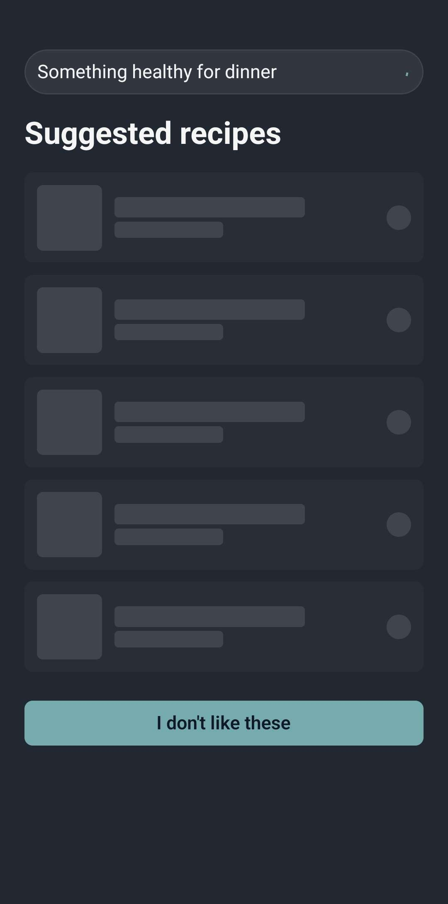
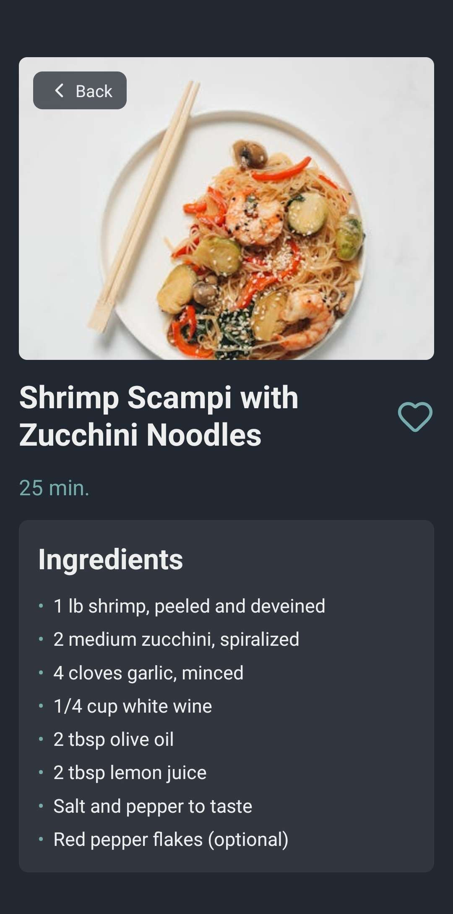
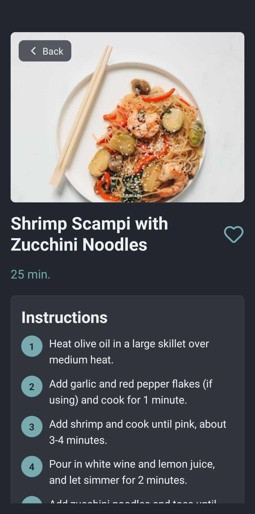
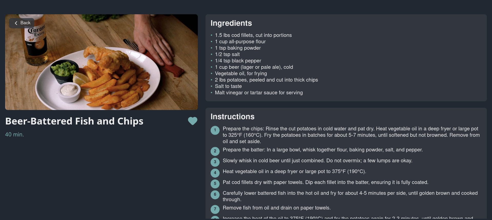

# AI-Powered Recipe Finder 🍳

[](https://reactnative.dev/)
[](https://expo.dev/)
[](https://www.typescriptlang.org/)
[](https://vercel.com/)
[](https://supabase.io/)

This is a React Native (Expo) application created for a technical challenge. The app functions as an **AI-Powered Recipe Finder**, allowing users to describe what they want to eat and receive a list of generated recipes. It includes secure authentication, a favorites system, and a smart suggestion engine.

The app's UI is based on the provided [Figma Design](https://www.figma.com/design/wuHnFuYeOER9m6VOHGmkif/Junior-FS%2FRN-Tech-Challenge?node-id=1259-80&p=f&t=dam1r53O6OpONAN9-0).

## Features

### AI-Powered Recipe Generation
Users can type a natural language description (e.g., "a quick vegan pasta for dinner" or "healthy breakfast with eggs") into the prompt. The app sends this to the backend, which uses the Google Gemini REST API to generate a list of suitable recipes.



### Smart Suggestions & "I don't like these"
If the user isn't satisfied with the initial suggestions, they can tap the "I don't like these" button. This triggers a new request to the backend. To ensure fresh results, the app sends the IDs of the *previously shown recipes* so the AI can exclude them from the new batch.



### Favorite Management
Users can easily save recipes to their personal favorites list. On the home screen, tapping the heart icon on any recipe card will add or remove it from their "Favorites" list, which can be viewed on a separate screen.



### Loading Skeletons
To improve the user experience, skeleton loaders are displayed while the recipes are being fetched from the backend. This gives the user immediate visual feedback that content is on its way, making the app feel more responsive.



### Adaptive Recipe Details Screen
The recipe details screen is fully responsive and provides two distinct layouts to ensure a great user experience on any device size. The top portion (name, image, cooking time) is static, while the bottom portion (ingredients, instructions) is scrollable.

* **Vertical Layout (Small Screens):** A standard, single-column layout perfect for phones held upright.
* **Horizontal Layout (Wide Screens):** A multi-column layout that takes advantage of the extra horizontal space, often showing ingredients and instructions side-by-side.

**Vertical Layout**
<br>



**Horizontal Layout**
<br>


---

## Technical Architecture & Implementation

### 1. Authentication with Supabase
User security and session management are handled by **Supabase**. It provides a robust and easy-to-use backend for user sign-up, login, and managing user data, keeping the app secure.

### 2. Backend Deployment on Vercel
The entire backend is deployed as serverless functions on **Vercel**. This serverless architecture handles all communication with the Gemini API, processes data, and dynamically gathers images. It's highly scalable and requires no manual server management.

### 3. Gemini API Query Formatting
A key part of the implementation is how the app gets structured data from the AI. Instead of just asking for text, the backend sends a detailed prompt to the Gemini REST API that explicitly *instructs it to format its response as a specific JSON object*. This ensures that every recipe response is predictable and can be reliably parsed and displayed in the app.

### 4. Dynamic Recipe Image Gathering
The recipe images are *not* generated by the AI. After the Gemini API returns the recipe data (name, ingredients, etc.) as JSON, the Vercel backend performs a separate step to search for and retrieve a high-quality, relevant image for that specific recipe. This image is then sent to the mobile app along with the recipe details.

---

## Android APK Available
A pre-built Android `.apk` file is available in this repository for direct installation and testing on an Android device.

* **Find it here:** https://github.com/buian-dragos/tapptitude-recipe/blob/main/tapptitude-recipe_buian-dragos.apk

## Run it Locally

The backend is already deployed and live on Vercel, so no server setup is needed. You only need to run the frontend client.

1.  **Clone the repository:**
    ```sh
    git clone [https://github.com/buian-dragos/tapptitude-recipe.git](https://github.com/buian-dragos/tapptitude-recipe.git)
    ```

2.  **Navigate to the frontend directory:**
    ```sh
    cd tapptitude-recipe/expo-frontend
    ```

3.  **Install dependencies:**
    ```sh
    npm install
    ```

4.  **Run the app:**
    ```sh
    npx expo start
    ```
    This will open the Expo developer tools. You can then scan the QR code using the Expo Go app on your phone.
